# Past Performance Database - Enhanced State Tracking

This document contains the process flow diagram for the Past Performance Database system.

```mermaid
flowchart TD
    %% Trigger and Initial Setup Module
    subgraph "Trigger and Initial Setup"
        A[Timer Trigger] --> B[Send HTTP POST request to trigger AZ Function]
        B --> C[Pre-execution Health Check]
        C --> D{Services Available?}
        D -- No --> Err0[Log Service Unavailability]
        Err0 --> E0[Return 503 Service Unavailable]
        D -- Yes --> F[Initialize Performance Metrics]
    end

    %% Authentication Module
    subgraph "Authentication"
        F --> G[Get SharePoint Access Token]
        G --> H{Token Acquired?}
        H -- No --> I[Retry Token Acquisition]
        I --> J{Max Retries Reached?}
        J -- Yes --> Err1[Log Authentication Failure]
        Err1 --> K[Return 503 Service Unavailable]
        J -- No --> G
        H -- Yes --> L[Log Successful Authentication]
    end

    %% Log and State File Processing
    subgraph "Log and State File Processing"
        L --> M[Download Log File from SharePoint with Retry]
        M --> M1[Download PP_Keywords.json State File]
        M1 --> N{Files Downloaded?}
        N -- No --> Err2[Log File Access Error]
        Err2 --> O[Return 503 Service Unavailable]
        N -- Yes --> P{Log File: Any Previous Fatal Errors?}
        P -- Yes --> Err3[Log System in Error State]
        Err3 --> Q[Return 503 Service Unavailable]
        P -- No --> R[Parse State File]
    end

    %% Master Spreadsheet Quick Check
    subgraph "Master Spreadsheet Quick Check"
        R --> S[Get Master Spreadsheet Metadata Only]
        S --> T{Metadata Retrieved?}
        T -- No --> Err4[Log Metadata Retrieval Failure]
        Err4 --> U[Return 503 Service Unavailable]
        T -- Yes --> V[Compare Last-Modified Time with State File]
        V --> W{Master File Changed?}
        W -- No --> X[Update Logs: No Changes Required]
        X --> Y[Record Performance Metrics]
        Y --> Z[Return 200 Success - No Updates]
        W -- Yes --> AA[Download Master Keyword Spreadsheet]
    end

    %% Data Validation and Comparison
    subgraph "Data Validation and Comparison"
        AA --> AB{Download Successful?}
        AB -- No --> Err5[Log Download Failure]
        Err5 --> AC[Return 503 Service Unavailable]
        AB -- Yes --> AD[Load Master into pandas DataFrame]
        AD --> AE[Calculate Master File Hash]
        AE --> AF{Hash Matches State File?}
        AF -- Yes --> AG[Update Logs: No Changes Required]
        AG --> AH[Record Performance Metrics]
        AH --> AI[Return 200 Success - No Updates]
        AF -- No --> AJ[Identify Specific Changed Documents]
    end

    %% Document Planning
    subgraph "Document Planning"
        AJ --> AK[Download master.json with Retry]
        AK --> AL{Download Successful?}
        AL -- No --> Err6[Log Master JSON Failure]
        Err6 --> AM[Return 500 Internal Server Error]
        AL -- Yes --> AN[Parse JSON]
        AN --> AO[Create Document Processing Queue]
        AO --> AP[Prioritize Documents]
        AP --> AQ[Check Document Lock Status via SharePoint API]
    end

    %% Document Status Assessment
    subgraph "Document Status Assessment"
        AQ --> AR[Filter Currently Locked Documents]
        AR --> AS[Check Retry Counts from State File]
        AS --> AT[Apply Exponential Backoff for Repeated Failures]
        AT --> AU[Create Final Processing List]
        AU --> AV{Any Documents to Process?}
        AV -- No --> AW[Update Logs: All Documents Locked or Skipped]
        AW --> AX[Update State File with New Attempt Counts]
        AX --> AY[Return 200 Success - No Updates Possible]
        AV -- Yes --> AZ[Begin Transaction]
    end

    %% Document Processing Module
    subgraph "Document Processing"
        AZ --> BA[Process Documents in Batches]
        
        %% Document Processing Loop
        subgraph "Document Processing Loop"
            BA --> BB[Download Document Metadata]
            BB --> BC{Document Available?}
            BC -- No --> BD[Log Document Unavailable]
            BD --> BE[Update State with Increased Attempt Count]
            BC -- Yes --> BF[Download File to Temp with Retry]
            BF --> BG{Download Successful?}
            BG -- No --> BH[Log Individual Document Failure]
            BH --> BI[Update State with Increased Attempt Count]
            BG -- Yes --> BJ[Load Keyword Sheet using openpyxl]
            BJ --> BK[Compare with Required Changes]
            BK --> BL{Changes Needed?}
            BL -- No --> BM[Log No Changes Required for Document]
            BM --> BN[Update State with Success Status]
            BL -- Yes --> BO[Identify Bold and Checked Rows]
            BO --> BP[Save Current Format as Backup]
            BP --> BQ[Update Sheet with New Keywords]
            BQ --> BR[Verify Updates]
            BR --> BS{Update Successful?}
            BS -- No --> BT[Restore from Backup]
            BT --> BU[Log Update Failure]
            BU --> BV[Update State with Failure Status]
            BS -- Yes --> BW[Upload Updated Document]
            BW --> BX[Clean Up Temp Files]
            BX --> BY[Update State with Success Status]
        end
        
        BY --> BZ[Check Next Document]
        BZ --> CA{More Documents?}
        CA -- Yes --> BB
        CA -- No --> CB[Analyze Results]
    end

    %% Result Analysis and State Update
    subgraph "Result Analysis and State Update"
        CB --> CC{Any Documents Successfully Updated?}
        CC -- No --> CD[Rollback Transaction Where Possible]
        CD --> CE[Log Complete Failure]
        CE --> CF[Update State File with Attempt Counts]
        CF --> CG[Record Performance Metrics]
        CG --> CH[Return 500 Internal Server Error]
        
        CC -- Yes --> CI[Commit Successful Document Updates]
        CI --> CJ[Calculate New Master Hash]
        CJ --> CK[Update PP_Keywords.json with:]
        CK --> CM[• New Master Hash </br> • Document-specific Status </br> • Attempt Counts </br> • Success/Failure Timestamps]
        
        CM --> CP{All Documents Successful?}
        CP -- Yes --> CQ[Log Complete Success]
        CQ --> CR[Record Performance Metrics]
        CR --> CS[Return 200 Success]
        CP -- No --> CT[Log Partial Success]
        CT --> CU[Record Performance Metrics]
        CU --> CV[Return 207 Multi-Status]
    end

    %% Error Handling for Unexpected Errors
    Err0 --> ErrorLog[Central Error Logging]
    Err1 --> ErrorLog
    Err2 --> ErrorLog
    Err3 --> ErrorLog
    Err4 --> ErrorLog
    Err5 --> ErrorLog
    Err6 --> ErrorLog
    BH --> ErrorLog
    BU --> ErrorLog
    CE --> ErrorLog

    %% Metrics Collection
    Y --> MetricsDB[Performance Metrics Database]
    AH --> MetricsDB
    AY --> MetricsDB
    CR --> MetricsDB
    CU --> MetricsDB
    CG --> MetricsDB
```

## Process Flow Description

This flowchart illustrates the enhanced state tracking system for the Past Performance Database. The process is organized into the following main sections:

1. **Trigger and Initial Setup**: The process begins with a timer trigger that initiates the Azure Function.

2. **Authentication**: Securely obtains a SharePoint access token with retry mechanism.

3. **Log and State File Processing**: Downloads and checks log files and the state tracking JSON file.

4. **Master Spreadsheet Quick Check**: Performs a lightweight metadata check to determine if the master spreadsheet has changed.

5. **Data Validation and Comparison**: If metadata indicates changes, downloads and validates the master spreadsheet.

6. **Document Planning**: Creates a prioritized list of documents that need processing.

7. **Document Status Assessment**: Applies intelligent filtering based on document availability and retry history.

8. **Document Processing**: The core document update logic with preservation of formatting.

9. **Result Analysis and State Update**: Updates the state tracking file with detailed document status information.

All errors are centrally logged, and performance metrics are recorded at various completion points.
